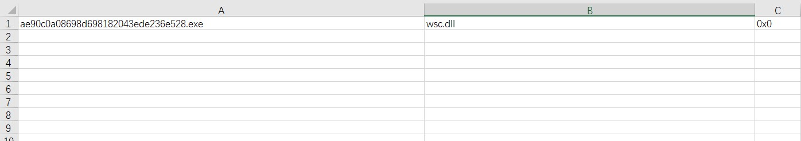

# SideloadFinder
-----------------

## Description

A simple script which automates the process of discovering and exploiting DLL Hijacks in target binaries by frida hook.

## Usage:
```
sideload_finder.py  -i  testcase -o out.csv

ae90c0a08698d698182043ede236e528.exe,wsc.dll,0x0
```

<p align="center">
 
</p>

## Reference 
https://github.com/knight0x07/ImpulsiveDLLHijack